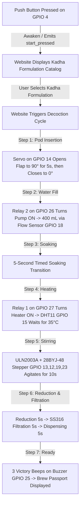

# iKwath ESP32 Hardware Connection & Wiring Guide (v4.0)

This guide provides the complete circuit pinout, schematic diagram, and wiring instructions for interfacing the **ESP32 DevKit** with the **iKwath Smart Automated Ayurvedic Decoction Machine**.

---

## 1. Automated Workflow Sequence



---

## 2. Master ESP32 Pinout Mapping Table

| Component | Pin / Signal | ESP32 GPIO | Operating Voltage | Notes / Logic Type |
| :--- | :--- | :---: | :---: | :--- |
| **Push Button** | Terminal 1<br>Terminal 2 | **GPIO 4**<br>**GND** | 3.3V Logic | `INPUT_PULLUP` (Active LOW). Pressing grounds GPIO 4. |
| **Servo Motor** *(Pod Flap)* | PWM Signal (Orange/Yellow)<br>VCC (Red)<br>GND (Brown/Black) | **GPIO 14**<br>**5V (Vin / Ext 5V)**<br>**GND** | 5V DC | 0° = Closed Flap<br>90° = Open (5 seconds for pod drop) |
| **Hall Flow Sensor** *(Water)* | Pulse Signal (Yellow)<br>VCC (Red)<br>GND (Black) | **GPIO 18**<br>**5V (Vin / Ext 5V)**<br>**GND** | 5V DC | Hardware Interrupt (`FALLING`). 400 mL cutoff. |
| **DHT11 Sensor** *(Temp & Humidity)* | DATA (Pin 2 / S)<br>VCC (Pin 1 / +)<br>GND (Pin 4 / -) | **GPIO 15**<br>**3.3V (or 5V)**<br>**GND** | 3.3V – 5V DC | Monitors decoction temperature until **35°C**. |
| **28BYJ-48 Stepper** *(ULN2003A Driver)* | `IN1`<br>`IN2`<br>`IN3`<br>`IN4`<br>`+` (VCC)<br>`-` (GND) | **GPIO 13**<br>**GPIO 12**<br>**GPIO 19**<br>**GPIO 23**<br>**5V (Ext 5V)**<br>**GND** | 5V DC | 4-phase 8-step half-stepping unipolar motor for non-blocking 10-second liquid agitation. |
| **2-Channel Relay Module** *(2PH63091A)* | `IN1` (Heater)<br>`IN2` (Water Pump)<br>`VCC`<br>`GND` | **GPIO 27**<br>**GPIO 26**<br>**5V (Vin / Ext 5V)**<br>**GND** | 5V DC Signal | **Active LOW** optocoupler triggers:<br>• `IN1` = Heating element / hotplate<br>• `IN2` = Peristaltic / DC water pump |
| **Active Buzzer** | Positive (+) Long Leg<br>Negative (-) Short Leg | **GPIO 25**<br>**GND** | 3.3V – 5V DC | Audible chirps and 3 victory beeps on completion. |
| **Built-in Status LED** | Anode | **GPIO 2** | 3.3V | Solid ON when system is active and ready. |

---

## 3. Detailed Component Wiring Diagrams

### A. Physical Push Button (Wakeup / Start / Pause)
Connect a 2-pin tactile push button between **GPIO 4** and **GND**:
```
  Push Button                  ESP32 DevKit V1
 +------------+               +----------------+
 |   [Pin 1]  |-------------->| GPIO 4         |
 |   [Pin 2]  |-------------->| GND            |
 +------------+               +----------------+
 (Uses ESP32 internal pull-up: pinMode(4, INPUT_PULLUP))
```
- **From Home Screen**: Pressing the button awakens the machine and navigates the website to the **Kadha Catalog** (`formulations`).
- **From Formulation/Confirm Screen**: Pressing the button starts the automated decoction cycle.
- **During Active Brewing**: Pressing toggles Pause / Resume.

---

### B. Pod Insertion Servo Motor (GPIO 14)
```
  Servo Motor (SG90 / MG90S)   ESP32 & Power
 +--------------------------+ +----------------+
 | Signal (Orange/Yellow)   |-> GPIO 14        |
 | VCC (Red)                |-> External +5V   |
 | GND (Brown/Black)        |-> Common GND     |
 +--------------------------+ +----------------+
```
- Holds flap open at **90° for exactly 5 seconds** when brewing begins so the herbal pod can be placed into the chamber.
- Closes flap to **0°** before water fill starts.

---

### C. 2-Channel Relay Module (2PH63091A)
The 2-channel relay controls the high-power loads (**Heater** and **Water Pump**):

```
       [ 2PH63091A 2-CHANNEL RELAY MODULE ]
     +----------------------------------------+
     | [NO1] [COM1] [NC1]  [NO2] [COM2] [NC2] |
     |      RELAY 1               RELAY 2     |
     |     (HEATER)               (PUMP)      |
     |                                        |
     |  [GND] [IN1] [IN2] [VCC]               |
     +---|------|-----|-----|-----------------+
         |      |     |     |
         |      |     |     +---> ESP32 5V (VIN) / Ext 5V
         |      |     +---------> ESP32 GPIO 26 (Pump Trigger - Active LOW)
         |      +---------------> ESP32 GPIO 27 (Heater Trigger - Active LOW)
         +----------------------> Common GND
```

#### Load Side Connections:
1. **Relay 1 (Heater / Hotplate / Heating Element)**:
   - **`COM1`**: Connect to AC Live / DC (+) Power Source.
   - **`NO1`**: Connect to Heater (+) or Live terminal.
   - *(Turns ON during `PHASE_HEATING` until DHT11 reads >= 35°C).*
2. **Relay 2 (Water Pump / Solenoid Valve)**:
   - **`COM2`**: Connect to Pump DC Power Supply (+) line (+12V or +5V).
   - **`NO2`**: Connect to Pump (+) motor wire.
   - **Pump (-) wire**: Connect directly to Pump Power Supply GND / (-).
   - *(Turns ON during `PHASE_WATER_FILL` until flow sensor measures 400 mL).*

---

### D. 28BYJ-48 Stepper Motor + ULN2003A Driver (Stirrer)
```
   ULN2003A Driver Board       ESP32 DevKit V1
 +-----------------------+    +----------------+
 | IN1                   |--->| GPIO 13        |
 | IN2                   |--->| GPIO 12        |
 | IN3                   |--->| GPIO 19        |
 | IN4                   |--->| GPIO 23        |
 | + (VCC)               |--->| External +5V   |
 | - (GND)               |--->| Common GND     |
 +-----------------------+    +----------------+
             |
   [5-Pin JST Connector]
             v
     28BYJ-48 Stepper
```
- Performs half-stepping bidirectional agitation for **10 seconds** during `PHASE_STIRRING`.
- Automatically de-energizes all 4 coils (`LOW`) when stirring ends to keep the motor cool.

---

### E. DHT11 Temperature & Humidity Sensor (GPIO 15)
```
  3-Pin DHT11 Module           ESP32 DevKit V1
 +--------------------+       +----------------+
 | S / DATA / OUT     |------>| GPIO 15        |
 | + / VCC            |------>| 3.3V (or 5V)   |
 | - / GND            |------>| Common GND     |
 +--------------------+       +----------------+
```
- Measures live decoction temperature with 0.1°C precision.
- Signals completion when temperature reaches the user's **35°C target**.

---

### F. Hall Effect Water Flow Sensor (GPIO 18)
```
  Flow Sensor (6mm ID)         ESP32 DevKit V1
 +--------------------+       +----------------+
 | Signal (Yellow)    |------>| GPIO 18        |
 | VCC (Red)          |------>| 5V (Vin)       |
 | GND (Black)        |------>| Common GND     |
 +--------------------+       +----------------+
```
- Measures water flow in real-time via hardware interrupt.
- Automatically cuts off Relay 2 when volume reaches **400 mL**.

---

### G. Active Piezo Buzzer (GPIO 25)
```
  Active Buzzer                ESP32 DevKit V1
 +--------------------+       +----------------+
 | Positive (+) Long  |------>| GPIO 25        |
 | Negative (-) Short |------>| Common GND     |
 +--------------------+       +----------------+
```
- Emits feedback chirps on button presses and 3 celebratory beeps when Kadha is ready.

---

## 4. Master Schematic Diagram

```
+----------------------------------------------------------------------------------------------------+
|                                    iKwath ESP32 CIRCUIT DIAGRAM                                    |
+----------------------------------------------------------------------------------------------------+

                          +5V External Power Supply -------------+---------------+-------------------+
                                                                 |               |                   |
                          GND External Power Supply --------+    |               |                   |
                                                            |    |               |                   |
                             +------------------------+     |    |               |                   |
                             |      ESP32 DevKit      |     |    |               |                   |
                             |                        |     |    |               |                   |
             Push Button <---| GPIO 4             5V  |<----+----+               |                   |
                  |          |                    GND |<----+ (Common GND)       |                   |
                 GND         |                    3V3 |------+                   |                   |
                             |                        |      |                   |                   |
        DHT11 Sensor Data <--| GPIO 15                |      | (DHT11 3.3V)      |                   |
                             |                        |      |                   |                   |
      Flow Sensor (Yellow)<--| GPIO 18 (Interrupt)    |      |                   |                   |
                             |                        |      |                   |                   |
        ULN2003A IN1 (Stir)<--| GPIO 13                |      |                   |                   |
        ULN2003A IN2 (Stir)<--| GPIO 12                |      |                   |                   |
        ULN2003A IN3 (Stir)<--| GPIO 19                |      |                   |                   |
        ULN2003A IN4 (Stir)<--| GPIO 23                |      |                   |                   |
                             |                        |      |                   |                   |
         Pod Servo (Flap)<---| GPIO 14 (PWM)          |      |                   |                   |
                             |                        |      |                   |                   |
          Buzzer Positive <--| GPIO 25                |      |                   |                   |
        Relay 2 (Water Pump)<-| GPIO 26 (Active LOW)   |      |                   |                   |
        Relay 1 (Heater) <---| GPIO 27 (Active LOW)   |      |                   |                   |
                             +------------------------+      |                   |                   |
                                                             |                   |                   |
      DHT11 Temp Sensor:                                     |                   |                   |
        - DATA ------------------ GPIO 15                    |                   |                   |
        - VCC -----------------------------------------------+                   |                   |
        - GND ------------------- (Common GND)                                   |                   |
                                                                                 |                   |
      Flow Sensor (6mm):                                                         |                   |
        - SIGNAL ---------------- GPIO 18                                        |                   |
        - VCC -------------------------------------------------------------------+                   |
        - GND ------------------- (Common GND)                                                       |
                                                                                                     |
      Servo Motor (Pod Flap):                                                                        |
        - SIGNAL ---------------- GPIO 14                                                            |
        - VCC ---------------------------------------------------------------------------------------+
        - GND ------------------- (Common GND)                                                       |
                                                                                                     |
      ULN2003A Stepper Driver (Stirrer):                                                             |
        - IN1, IN2, IN3, IN4 ---- GPIO 13, 12, 19, 23                                                |
        - VCC (+) -----------------------------------------------------------------------------------+
        - GND (-) --------------- (Common GND)                                                       |
                                                                                                     |
      2PH63091A 2-Channel Relay:                                                                     |
        - IN1 (Heater) ---------- GPIO 27 (Active LOW)                                               |
        - IN2 (Pump) ------------ GPIO 26 (Active LOW)                                               |
        - VCC ---------------------------------------------------------------------------------------+
        - GND ------------------- (Common GND)
+----------------------------------------------------------------------------------------------------+
```

---

## 5. Web Application Integration & Flashing

1. **Flash Firmware**:
   - Open Arduino IDE or Arduino CLI.
   - Select Board: **ESP32 Dev Module** (or `esp32:esp32:esp32`).
   - Select Port: **COM6** (or detected port).
   - Click **Upload**.

2. **Connect with Web Application**:
   - Open the web application at `http://localhost:3000/`.
   - Click **"Connect ESP32 (USB Serial)"** in the top navigation bar.
   - Select your ESP32 COM port and click **Connect**.
   - The browser automatically auto-reconnects on every refresh.

3. **Run the Full Cycle**:
   1. Press the **Push Button** on GPIO 4 $\rightarrow$ The website opens the **Kadha Catalog** screen.
   2. Select any Kadha on the website (e.g. *Ayush Kwatha*, *Ashwagandha*, *Triphala*, *Guduchi*, *Dashamoola*, *Maharasnadi*, *Punarnavadi*).
   3. The **Servo Motor** opens the pod flap (90°) for **5 seconds** and closes (0°).
   4. **Relay 2** activates the pump until **400 mL** is recorded by the flow sensor.
   5. **Soaking step** runs for **5 seconds**.
   6. **Relay 1** activates the heater until the **DHT11** sensor reaches **35°C**.
   7. The **28BYJ-48 Stepper Motor** agitates the decoction for **10 seconds**.
   8. **Reduction, Filtration, and Dispensing** complete with **5-second pauses**.
   9. **3 Victory Beeps** sound on the buzzer and the **Brew Passport** is generated!
